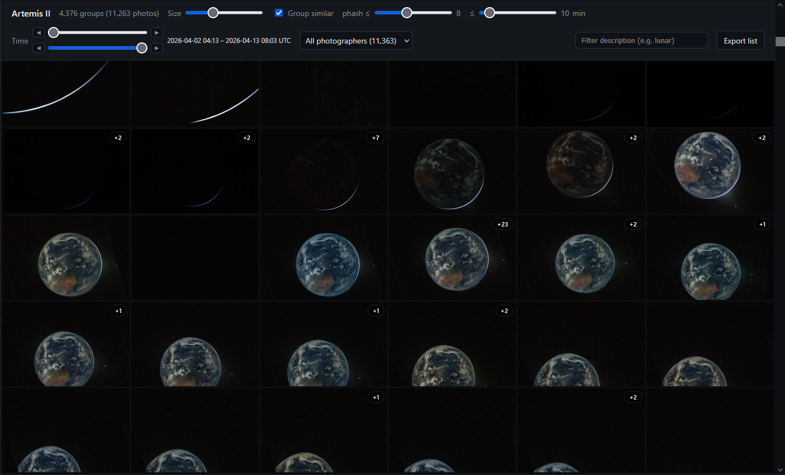

# Artemis II Photo Gallery



A static HTML viewer for the NASA EOL Artemis II image set, plus a Python
script that builds the metadata manifest the viewer reads.

### Skip to the Photos and thumbnails section. You do not need to run any python to get this tool to work. Just download the photos and open the html file.

## `make_thumbnails.py`

Generates one 256-px JPEG thumbnail per image in `./photos/` into
`./thumbnails/`, in parallel across CPU cores. Resumable — re-running skips
photos whose thumbnail already exists. Writes through a `.part` file +
atomic rename so a Ctrl-C never leaves a half-written thumbnail. Honors
EXIF orientation. Override `--size`, `--quality`, or `--workers` if needed.

## `build_manifest.py`

Scans `./photos/`, looks up matching thumbnails in `./thumbnails/`, and writes:

- `photos.json` — minified manifest (the source of truth).
- `photos.js` — a `loadPhotosManifest({...});` JSONP wrapper so the gallery
  can load it via `<script src>` without an HTTP server.

Each record carries filename, photo + thumbnail paths, file size, mtime,
image dimensions, EXIF capture time (`taken`), the IFD0 `ImageDescription`,
the photographer (one of Koch / Glover / Hansen / Wiseman, parsed from the
description), and a 64-bit perceptual hash. pHash is the only field cached
across runs — pass `--rebuild` to invalidate it. Re-run whenever the photo
set changes.

## `gallery.html`

Open directly in a browser — no web server needed; `photos.js` loads via a
`<script src>` and `file://` is fine.

- **Group similar photos** — single-link clustering on time proximity
  (≤ 10 min by default) and pHash similarity. Each group's cover thumbnail
  expands into a slideshow of its members. Toggle and thresholds live in the
  header.
- **Filters** — by photographer (with live counts), by capture-time range,
  and by description substring. All compose.
- **Lightbox** — full-size view with description and metadata. Hotkeys:
  ←/→ next/prev group, ↑/↓ next/prev photo within group, space play/pause
  slideshow, Esc close.
- **Export list** — copy the currently filtered filenames to the clipboard;
  group members are indented under their cover.

## Photos and thumbnails (download separately)

Download as ZIP, extract into the same folder as gallery.html - https://file.kiwi/086c80d6#wDLd0yM4tVLGpu-vjik23Q

This download may expire or become invalid soon. Hopefully someone hosts a
torrent I can link here instead soon.

`./photos/` and `./thumbnails/` are gitignored (the originals are ~several
GB) and **must be populated yourself** before `build_manifest.py` will have
anything to scan:

- `./photos/` — the full-size originals (any of `.jpg`, `.jpeg`, `.png`,
  `.tif`, `.tiff`, `.bmp`, `.webp`).
- `./thumbnails/` — one image per photo, named with the same stem (e.g.
  `photos/ART002-E-30001.JPG` → `thumbnails/ART002-E-30001.jpg`).
  `build_manifest.py` matches by stem and ignores extension differences.
  Easiest way to produce these is `uv run make_thumbnails.py`.

Workflow once `./photos/` is populated:

```
uv run make_thumbnails.py    # generates ./thumbnails/
uv run build_manifest.py     # writes photos.json + photos.js
```

Then open `gallery.html`.
